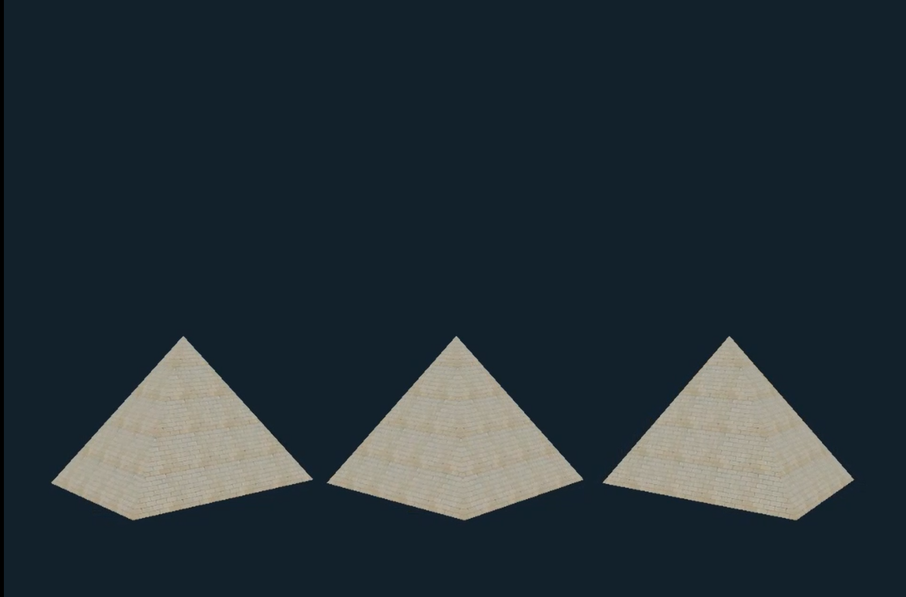

# 3D model done with OpenGL

This project was developed as part of the Computer Graphics course at Alexandria University. It demonstrates the creation of a simple 3D graphics model using OpenGL. The project renders multiple pyramids with textures and allows basic transformations, such as translation and rotation.

## Project Structure

- **`Main.cpp`**: The main entry point of the application, containing the window setup, main rendering loop, and input handling.
- **`Camera.cpp` / `Camera.h`**: Handles camera setup, movement, and view transformations.
- **`EBO.cpp` / `EBO.h`**: Element Buffer Object (EBO) management for handling indexed drawing.
- **`Texture.cpp` / `Texture.h`**: Texture loading and management using stb_image.
- **`VAO.cpp` / `VAO.h`**: Vertex Array Object (VAO) management for storing vertex attributes.
- **`VBO.cpp` / `VBO.h`**: Vertex Buffer Object (VBO) management for storing vertex data.
- **`shaderClass.cpp` / `shaderClass.h`**: Shader management for compiling, linking, and using vertex and fragment shaders.
- **`default.vert`**: Vertex shader for processing vertex attributes.
- **`default.frag`**: Fragment shader for handling pixel color outputs.
- **`Libraries`**: Contains third-party libraries such as GLAD, GLFW, stb_image, and GLM.
- **`Resources`**: Additional files like textures (`brick.png`, `ground_texture.png`) and shaders.

## Main Features

- **Rendering 3D Objects**: Renders multiple textured pyramids in a 3D space.
- **Transformations**: Supports rotation and translation transformations on the 3D objects.
- **Texture Mapping**: Applies texture to 3D objects using texture coordinates and fragment shaders.
- **Camera Controls**: Uses a camera class to manage view transformations.
- **Depth Buffering**: Enabled for correct rendering order of overlapping objects.

## Requirements

- **C++ Compiler**: GCC, Clang, or MSVC that supports C++11 or later.
- **Libraries**:
  - [GLFW](https://www.glfw.org/) - for window management and input handling.
  - [GLAD](https://glad.dav1d.de/) - for loading OpenGL extensions.
  - [GLM](https://github.com/g-truc/glm) - for mathematics operations.
  - [stb_image](https://github.com/nothings/stb) - for image loading.


### Running the Project

To run the project, you will need to compile it using a C++ compiler that supports C++11 or higher, along with OpenGL, GLFW, GLAD, and other dependencies.

```bash
# Example command to compile using g++ (ensure you have OpenGL and GLFW installed)
g++ -o GameEngine Main.cpp Camera.cpp EBO.cpp Texture.cpp VAO.cpp VBO.cpp shaderClass.cpp glad.c -lglfw -lGL -ldl
./GameEngine
```

### Rendering Output

The application renders a 3D scene with multiple pyramids that rotate around their y-axis. Below is a screenshot of the rendered scene:




## Contributing

Contributions are welcome! Feel free to fork the project and submit a pull request with your improvements.
